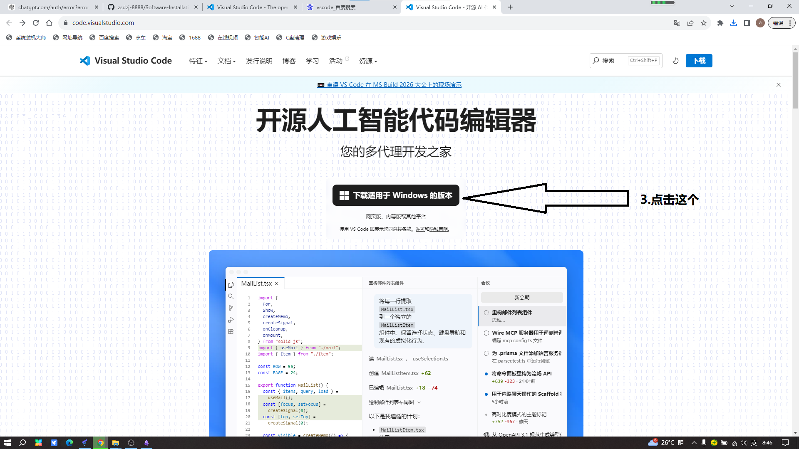
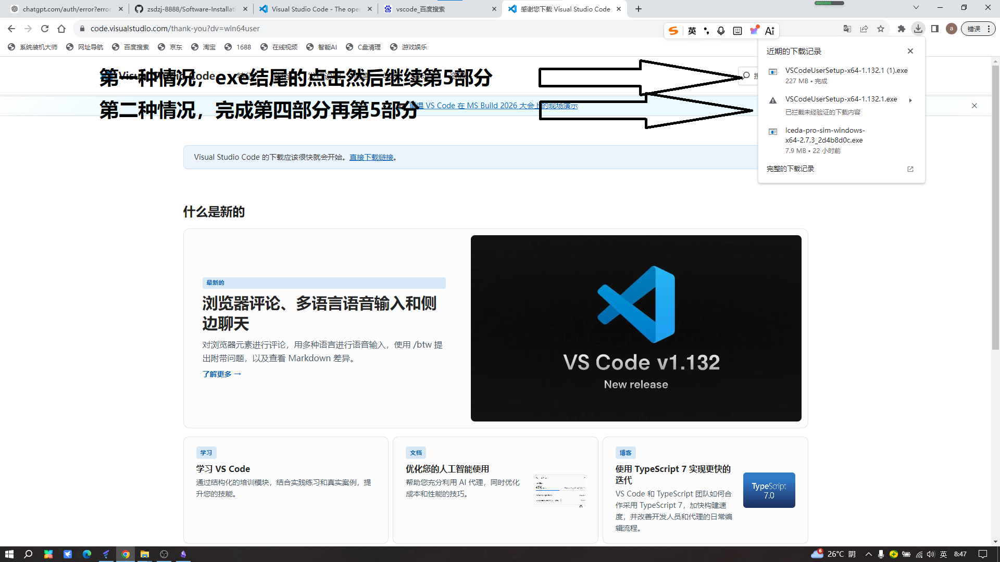
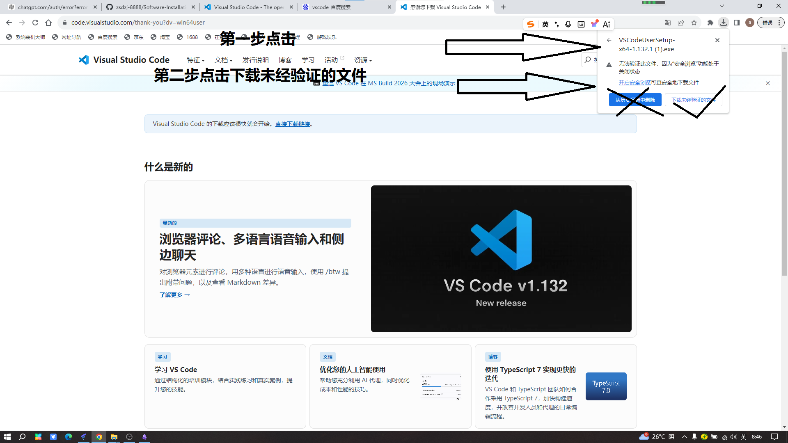

# 软件安装

### 第一步

>如果找不到官网点击：https://code.visualstudio.com/

### 第二步

>点击后会自动下载

### 第三步

### 第4步

### 第5步(正式软件安装)

>点"我同意协议"然后点击下一步

>这里最好更换默认的下载地址，因为C盘是系统盘，当然也可以选择默认，就是直接点击下一步就可以了

>直接点击下一步

>这里的默认是不勾选的，打沟进行选择，然后下一步

>点击安装，开始安装

>这里就安装完成了，点击完成

### 软件汉化

>打开软件并点击

>搜索Chinese,点击安装install

>点击重启变成中文

>到这里就结束了，就是vscode安装与汉化

